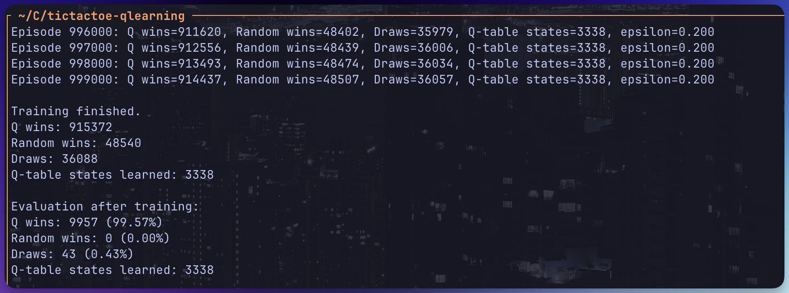

# QLearning TicTacToe

> This was just me playing around with Zig, so most of the code is not optimized at all.



## Installation & Usage
Clone the repository,
```bash
git clone git@github.com:atasoya/tictactoe-qlearning.git
cd tictactoe-qlearning
zig build
```

Training the agent (you can change the episodes count in `src/main.zig`):
```bash
./zig-out/bin/tictactoe_qlearning train
```

Evaluate the agent:
```bash
./zig-out/bin/tictactoe_qlearning evaluate
```

Play against the agent 
```bash
./zig-out/bin/tictactoe_qlearning play
```
Train, evaluate, then play:
```bash
./zig-out/bin/tictactoe_qlearning all
```
